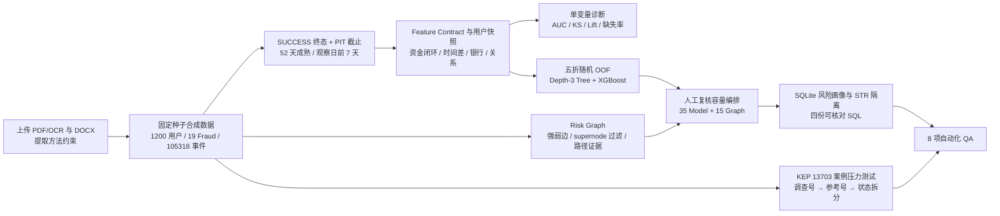

# CoinTR Fraud Journey 结果报告

## 1. 执行摘要

本项目把上传的 CoinTR 支付与数字资产风控资料中可公开复述的方法，整理为一条可重复运行、可审计的 Demo 链路：合成用户与事件生成、标签成熟与 PIT 截止、Feature Contract、单变量诊断、浅层 Tree、五折 XGBoost OOF、Risk Graph、人工复核队列、SQLite/四份 SQL，以及 KEP 主题匹配压力测试。

本次固定随机种子为 `20260728`，生成 **1,200** 个用户、**19** 个已确认合成 Fraud 标签和 **105,318** 条时间戳事件。最终得到 **15** 个可解释 Graph 候选、**50** 条人工复核记录以及 **13,703** 条合成 KEP 案件。核心模型结果如下：

- 浅层 Decision Tree 五折 OOF：AUC `0.901711`，KS `0.809082`，AP `0.214236`；
- XGBoost 五折 OOF：AUC `0.964704`，KS `0.855920`，AP `0.560990`；
- 复核队列按容量拆为 `35` 个模型排序席位和 `15` 个 Graph 补召回席位，Graph 产生 `15` 个 swap-in，同时换出模型单通道 Top 50 中的 `15` 个候选；
- SQLite 成功生成 11 张演示表，四份 SQL 分别输出 `1,200 / 80 / 1,200 / 13,703` 行；
- KEP 六类预设结果全部按固定规模落盘，调查号、参考号、`icra` 排除、未找到与业务未回复均保持独立状态。

这些数字只证明代码链路和审计约束能够运行，不代表 CoinTR 的真实模型效果、真实案件规模或生产策略表现。

## 2. 真实性与使用边界

本报告中的用户、标签、事件、银行、设备、IP、地址、图关系、邮件、阈值、模型分数、SQL 结果和 KEP 案件均为**确定性合成数据**。仓库没有接入 CoinTR 或其他公司的生产数据库、CMS、KEP、邮箱、风控引擎或监管系统，也没有使用真实客户信息。

必须同时遵守以下边界：

1. `fraud_label=1` 仅表示生成器指定的 19 个合成已确认样本；`fraud_label=0` 是 `INCONCLUSIVE_UNCONFIRMED`，不能直接解释为正常或误报。
2. 模型指标来自**五折随机 Stratified OOF**，不是 OOT、时间外推、跨市场验证或线上 A/B 结果。
3. XGBoost 训练折使用 1:4 负样本下采样，输出分数**未做概率校准**；综合复核分和 SQLite risk band 只能用于合成队列排序，不能解释为欺诈概率。
4. `tree_rules.txt` 来自全量样本再次拟合后的可读规则抽取，仅是探索结果，统一标记 `exploratory_full_fit_not_oof_validated`，不是验证过的生产阈值。
5. API 使用占比与夜间事件占比只保留为 `context-only` 描述。即使在这批合成数据上有方向性，也不进入 Tree/XGBoost，不能单独转成风险规则。
6. Graph 候选只提供关联调查线索，不构成身份或欺诈结论；不得自动改标、冻结、限制资金或处罚。
7. STR 表是访问隔离的内部候选演示。普通客户画像不暴露 STR 详情，`automatic_external_filing_allowed=false`，不得自动外发。
8. KEP 仅做离线、确定性主题匹配。真实浏览器流程要求人工登录、检查点续跑和人工确认，`automatic_send_allowed=false`。

## 3. 上传资料约束与项目落点

| 资料中的方法约束 | 项目落点 | 本次可核验结果 |
|---|---|---|
| 从注册、KYC、法币入金、交易到链上出金还原 Fraud Journey | 合成用户及事件生成器、`event_summary.csv` | 1,200 用户、105,318 事件，覆盖现货/API 六个币对和完整生命周期 |
| 标签约 52 天成熟，标签 0 不等于正常 | `label_observed_at`、PIT 特征截止、人工队列标签解释 | 标签观察点为注册后 52 天；所有 label-0 候选标为 `INCONCLUSIVE_UNCONFIRMED` |
| 特征要有定义、来源、窗口、可用时间和 owner | `feature_contracts.csv` | 27 条 Feature Contract，六个治理字段齐全 |
| 只使用当时已可见的数据，排除非终态与未来信息 | `features.py`、`feature_build_audit.json` | 只计 `SUCCESS`，截止为标签观察日前 7 天，`point_in_time_safe=true`；未实现业务交易键去重 |
| 金额不能单独代表风险，要同时检查闭环、时间差、小额、银行、设备/IP/地址 | 25 个模型输入与单变量诊断 | `fund_loop_cv`、`amount_diff_ratio`、时间差、银行及关系特征并列分析 |
| API/夜间没有稳定、普适的风险方向 | `CONTEXT_ONLY_FEATURES` | 两项均不进入模型或独立规则 |
| 先可解释基线，再用 XGBoost，并以 Graph 补召回 | Tree、XGBoost OOF、Risk Graph | 两个模型均输出 OOF 指标；Graph 单独产生 15 个可解释候选 |
| 图关系要区分强弱边并控制 supernode 噪声 | `graph.py`、`graph_audit.json` | KYC/Device/Phone（Mobile）/Email/Withdraw Address 为强关系；IP 权重 0.25；过滤 7 个公共或 supernode 标识 |
| 模型结果必须落到人工容量、重叠和 swap 分析 | `alert_capacity.json`、`human_review_queue.csv` | 35 个模型席位 + 15 个 Graph 席位；swap-in/out 均为 15 |
| Onboarding、T+1、动态画像和人工 override 分层留痕 | SQLite `risk_profile_history` | 本次合成快照写入 3,606 条历史行；每个用户恰有一个 current 状态，人工 override 在单次生成结果中优先 |
| STR 信息需要隔离，不能自动报送 | `str_cases`、`02_str_case_mart.sql` | 80 条合成内部候选；普通画像无 STR 字段；自动外发始终关闭 |
| KEP 先调查号、再参考号，严格限定 `Konu:`，排除 `icra` | `kep.py`、KEP 输出 | 六种状态共 13,703 条；未找到与业务未回复分开；实时入口要求人工登录 |

更细的资料—实现映射见 [SOURCE_METHOD_MAPPING.md](SOURCE_METHOD_MAPPING.md)。

## 4. 端到端执行流程



## 5. 逐步执行过程

### 5.1 合成 Fraud Journey

生成器以固定种子创建 1,200 个用户，并精确指定 19 个合成 Fraud 标签。事件链覆盖注册、KYC、设备绑定/登录、法币入金、现货交易、API 交易、内部转账、链上出金以及账户安全事件；交易覆盖 `BTC_TRY`、`BTC_USDT`、`ETH_TRY`、`ETH_USDT`、`USDC_USDT`、`USDT_TRY` 六个合成币对。

总计生成 105,318 条事件。它们保留 `SUCCESS / FAILED / PENDING` 状态，以便验证终态过滤不会把失败或处理中事件计入资金和行为特征。事件 `event_id` 唯一，但当前 Demo 没有业务交易键，也没有实现同一笔业务跨状态的去重。原始事件只存入 SQLite，没有额外提交大体积 raw event CSV。

### 5.2 标签成熟、终态过滤与 PIT

每个用户的标签观察时间设置为注册后约 52 天；特征截止设置为 `label_observed_at - 7 days`。构建特征时同时要求：

- 事件状态为 `SUCCESS`；
- `available_at` 不晚于该用户的特征截止；
- 衍生比例只能在其所有输入字段可用后计算。

审计结果为：105,318 条输入事件中，97,597 条属于 `SUCCESS` 终态，66,837 条满足最终 PIT 条件，38,481 条因状态或截止条件未进入特征。审计文件给出 `point_in_time_safe=true`。这一步的目的不是让样本更“好看”，而是保证模型只能看到当时真正可用的信息。

### 5.3 Feature Contract 与单变量分析

`feature_contracts.csv` 为 27 个字段记录 `feature / definition / source / window / available_at / owner`。其中 25 个是模型候选输入，另有 API 与夜间占比两个 context-only 字段。25 个数值字段进入单变量诊断，其中 23 个是数值型模型输入，另外 2 个仅供上下文观察；两个类别型模型输入 `registration_channel` 和 `kyc_level` 由折内 one-hot 处理，不出现在数值单变量表中。

单变量阶段计算方向自适应 AUC、KS、tie-aware Lift@10%/20%、缺失率和唯一值数量。它只用于说明合成样本中的单变量分离度，不用于在验证折上挑选特征，也不证明任何变量具有真实业务因果关系。

### 5.4 五折随机 OOF：Tree 与 XGBoost

数据按 `user_id` 稳定排序后，使用固定种子的五折 `StratifiedKFold`。每折验证集 240 人，正例数依次为 `3 / 4 / 4 / 4 / 4`。

- **Decision Tree**：最大深度 3，每折使用 960 条训练记录，不做负样本下采样；数值缺失以训练折中位数填充，类别缺失以训练折众数填充并 one-hot。
- **XGBoost**：160 棵树、深度 3、学习率 0.045。只在训练折内按 1:4 下采样：第一折为 16 正 + 64 负，其余各折为 15 正 + 60 负。验证折不重采样，验证标签不参与 fit。

所有 1,200 个用户都只由“没有训练过该用户”的折模型产生一次 OOF 分数。模型指标基于拼接后的完整 OOF 分数计算。之后另行对全量样本拟合浅层 Tree，只为把分裂还原成业务单位和类别条件；其叶节点正例率不是 OOF 指标，产出的规则动作仍然只是 `MANUAL_REVIEW`。

### 5.5 Risk Graph

图谱采用“用户—标识—用户”的二部图。KYC ID、Device、Phone、Email 和 Withdraw Address 的权重不低于 0.8；IP 权重仅为 0.25。代码明确禁止把入金地址加入关系图，并过滤公共 IP、交易所归集前缀、企业代理前缀和度数过高的 supernode。本次共过滤 7 个噪声标识。

对 label-0 用户，只在其与已确认合成 Fraud 用户存在共享标识路径时产生候选。输出保留关系类型、两侧首次/最后时间、方向、事件数和金额等证据。最终按图分数及强关系路径排序得到 15 个候选；这些候选不是独立验证样本，也不自动触发处置。

### 5.6 35 + 15 人工复核队列与 swap

容量固定为 50，占 1,200 个用户的 4.17%。先保留 15 个 Graph 补召回席位，再从非 Graph 候选中按 XGBoost OOF 分数选择 35 个模型席位。综合排序使用 `50% × XGBoost OOF 百分位 + 50% × Graph 分数`；该值只是调查优先级，不是联合模型概率。

单看模型 Top 50 时，它与 15 个 Graph 候选的交集为 0。组合队列纳入全部 15 个 Graph 候选，因此相对模型单通道发生 15 个 swap-in 和 15 个 swap-out，明确展示了“模型排序”和“可解释关系补召回”对有限人工容量的不同贡献。所有队列记录均保持 `automatic_relabel_allowed=false` 和 `automatic_external_filing_allowed=false`。

### 5.7 SQLite 与四份 SQL

主流程把明细和结果写入 `cointr_fraud_demo.sqlite`。关键表包括 1,200 个用户、105,318 条事件、1,200 条用户特征、1,200 条模型分数、50 条复核队列、15 条图候选、3,606 条风险画像历史、80 条内部 STR 候选、13,703 条 KEP 案件、13,382 封合成邮件和 13,703 条匹配结果。

四份 SQL 均显式说明粒度、主键、状态/时间、连接基数、PIT、窗口/序列和对账要求：

| SQL | 主要用途 | 输出行数 | 边界 |
|---|---|---:|---|
| `01_customer_risk_profile.sql` | 一用户一行的当前风险画像 | 1,200 | 不包含 STR 案件字段 |
| `02_str_case_mart.sql` | 隔离的内部 STR 候选状态 | 80 | 四类状态轴分开；不允许自动外发 |
| `03_fraud_feature_snapshot.sql` | 从 SUCCESS + PIT 事件重算关键特征 | 1,200 | 可与用户特征快照对账 |
| `04_kep_case_input.sql` | 规范化 KEP 调查号、参考号和案件类型 | 13,703 | 仅离线输入，不是操作指令流 |

本次生成的风险画像表依次写入 Onboarding 静态快照、注册后 T+1 可用事件快照、全部模型输入可用后的动态快照，以及少量合成人工 override。单次结果中每个用户只有一条 current 记录，人工 override 被设为 current；但主流程会删除并重建 SQLite，尚未实现生产级不可变约束、增量刷新 API 或跨批次 override 保护。

### 5.8 KEP 13,703 条压力测试

KEP 层先规范化土耳其字符和编号，只在严格 `Konu:` 段内提取标识。合格外发邮件必须同时满足 `GIDEN` 与 `ORİJİNAL`；先查询 `sorusturma_no`，无唯一结果时再查询 `sayi/reference`，`icra` 单独排除。

`NOT_FOUND` 只表示没有合格匹配，不能被解释为业务未回复。`BUSINESS_NO_RESPONSE` 要求存在可追溯的来信证据、但没有合格外发回复。歧义、未找到和未回复均进入人工检查。所有结果都带 90 秒 timeout、`case_id` resume key、实时浏览器人工登录标记，并禁止自动发送。

### 5.9 QA 验证

交付验收时 `pytest` 的 8 个测试用例全部通过；仓库未保存独立的控制台日志，复核者可按第 9 节命令现场重跑。测试覆盖：

1. 精确校验 1,200 用户、19 标签、105,318 事件、15 Graph 和 50 队列，以及人工处置边界；
2. 核对审计产物声明的 52 天成熟、PIT、六币对清单、银行字段别名接受标记、IP 弱权重、无入金地址及 Tree 探索标记；当前测试没有单独注入银行别名或 supernode 边界案例；
3. 校验四份 SQL、普通画像的 STR 隔离、T+1/模型/override 时间顺序和 current 唯一性；
4. 校验 KEP 只能读取严格 `Konu:` 段；
5. 校验 13,703 条 KEP 的六类结果、人工登录、90 秒 timeout 与禁止自动发送；
6. 校验 Lift 在分数 ties 下对输入行顺序不敏感；
7. 通过翻转验证标签，校验折内预测不读取验证标签；
8. 校验 Tree 的数值和类别分裂能够还原为业务单位条件。

## 6. 关键结果

### 6.1 模型 OOF 指标

| 模型 | 样本/正例 | OOF AUC | OOF KS | OOF AP | Tie-aware Lift@10% | Tie-aware Lift@20% |
|---|---:|---:|---:|---:|---:|---:|
| Decision Tree depth 3 | 1,200 / 19 | 0.901711 | 0.809082 | 0.214236 | 8.510687 | 4.338083 |
| XGBoost OOF | 1,200 / 19 | 0.964704 | 0.855920 | 0.560990 | 8.947368 | 4.736842 |

AP 为 Average Precision。Lift 对阈值处相同分数按比例计入，不依赖输入行顺序。XGBoost 在这批合成数据上的排序能力高于浅层 Tree，但由于正例仅 19 个、数据模式由生成器定义且分数未校准，不能将差异外推到生产场景。

### 6.2 Top 单变量诊断

| 排名 | 特征 | 合成样本方向 | AUC | KS | Lift@10% | Lift@20% |
|---:|---|---|---:|---:|---:|---:|
| 1 | `deposit_count` | 越高风险方向越强 | 0.908663 | 0.642007 | 7.263158 | 3.684211 |
| 2 | `fund_loop_cv` | 越低风险方向越强 | 0.891840 | 0.647756 | 6.315789 | 3.947368 |
| 3 | `amount_diff_ratio` | 越低风险方向越强 | 0.890013 | 0.638442 | 6.315789 | 3.947368 |
| 4 | `total_event_count` | 越高风险方向越强 | 0.888475 | 0.690940 | 5.175439 | 3.947368 |
| 5 | `withdrawal_count` | 越高风险方向越强 | 0.876421 | 0.653149 | 6.707152 | 3.947368 |
| 6 | `trade_count` | 越高风险方向越强 | 0.863162 | 0.634075 | 4.245614 | 3.494152 |
| 7 | `small_fiat_deposit_count` | 越高风险方向越强 | 0.838830 | 0.529123 | 6.120301 | 3.397969 |
| 8 | `withdrawal_amount` | 越高风险方向越强 | 0.821962 | 0.615580 | 3.157895 | 2.631579 |
| 9 | `withdraw_deposit_ratio` | 越高风险方向越强 | 0.810910 | 0.554481 | 1.578947 | 3.684211 |
| 10 | `kyc_to_first_deposit_minutes` | 越低风险方向越强 | 0.802754 | 0.664691 | 2.105263 | 2.105263 |

这里的“方向”由合成样本单变量排序得到，只能作为描述。特别是 `api_event_ratio` 和 `night_event_ratio` 即使分别得到方向自适应 AUC `0.756963` 和 `0.674250`，仍按资料约束设为 context-only，不能机械解释成 API 或夜间活动有罪。

### 6.3 Graph 与人工容量

| 指标 | 结果 |
|---|---:|
| 可解释 Graph 候选 | 15 |
| IP 权重 | 0.25 |
| 强关系最低权重 | 0.8 |
| 被过滤的公共/归集/代理/supernode 标识 | 7 |
| 模型队列席位 | 35 |
| Graph 补召回席位 | 15 |
| 总复核容量 / alert rate | 50 / 4.17% |
| 模型 Top 50 与 Graph 候选交集 | 0 |
| 组合队列中的 Graph 候选 | 15 |
| swap-in / swap-out | 15 / 15 |

结果表明，在这组刻意设计的合成数据中，Graph 找到的是模型 Top 50 没有覆盖的关联候选，因此能演示补召回逻辑。它不证明真实环境也会有同样的零重叠或提升幅度。

### 6.4 KEP 六类状态

| 状态 | 条数 | 含义 |
|---|---:|---|
| `MATCH_SORUSTURMA` | 12,068 | 调查号唯一命中合格外发邮件 |
| `MATCH_SAYI` | 939 | 调查号未命中后，参考号唯一命中 |
| `EXCLUDED_ICRA` | 378 | 案件类型属于排除范围 |
| `AMBIGUOUS_MULTIPLE` | 135 | 存在多个合格命中，需人工判断 |
| `NOT_FOUND` | 120 | 没有合格外发或来信证据，不推断业务状态 |
| `BUSINESS_NO_RESPONSE` | 63 | 有来信证据但没有合格外发回复，需人工跟进 |
| **合计** | **13,703** | 全部为合成压力测试案件 |

## 7. 结果解读

从工程角度看，本次最重要的结果不是单个 AUC，而是链路中的约束都能落盘并交叉验证：Feature Contract 能追溯字段来源和可用时间；OOF 清单能证明每折训练/验证隔离；Graph 路径能给出关系与时序证据；队列能展示固定容量下的 overlap 和 swap；SQL 能对账并隔离 STR；KEP 能把“未找到”和“未回复”分成不同状态。

从模型角度看，XGBoost 在合成样本上优于浅层 Tree，说明非线性组合可以更好地恢复生成器植入的模式；Tree 仍有价值，因为它提供可读的业务条件作为假设入口。两者不是替代关系：Tree 用于解释和质检，XGBoost 用于排序，Graph 用于关系补召回，最终都进入人工调查。

从业务角度看，单变量结果支持“不要只看金额”的方法：入金次数、资金闭环一致性、事件密度、出金次数、KYC 到首次入金时差等共同呈现差异。同时，项目有意保留 API/夜间的反直觉方向并将其排除出模型，说明结果解释服从业务与治理边界，而不是看见 AUC 就自动转规则。

## 8. 数字口径隔离、限制与下一步

### 8.1 `1,273 / 184 / 20` 与 `13,703` 必须隔离

上传资料中可核验的历史工作口径是：**1,273 条 CMS 记录、184 条疑似异常、抽样 20 条根因复核**。这些数字只作为资料中的历史方法背景，没有作为本项目的训练集、测试集或运行输入。

本项目的 **13,703** 是代码固定生成的 KEP 合成压力测试规模。两组数字来源、语义和用途完全不同，不得把 13,703 写成真实案件量，也不得把 1,273/184/20 写成本仓库的运行结果。

### 8.2 主要限制

- 合成数据的风险模式由生成器定义，模型可能只是在恢复生成规则；任何指标都不能外推到真实 CoinTR 用户。
- 只有 19 个正例，AUC、KS、AP 和 Lift 的方差会很大；当前没有置信区间、重复种子实验或显著性检验。
- 随机五折 OOF 只验证样本内泛化，不覆盖时间漂移、币种变化、渠道变化、国家差异或攻击迁移；尚无 OOT。
- XGBoost 因训练折下采样而未校准；当前分数和风险 band 不能用于概率阈值、损失预估或自动策略。
- 全量 Tree 规则仅用于探索，未经独立样本验证，不能直接上线。
- Graph 使用合成共享标识；即便过滤 supernode，真实公共设备、家庭网络、机构账户和交易所基础设施仍可能造成误关联。
- SQLite 与 SQL 是演示 schema，不代表生产表结构、权限模型、SLA 或数据质量；主运行会删除并重建数据库，未实现不可变历史或跨批次人工 override 保护。
- KEP 是离线主题匹配，不覆盖真实页面 DOM 漂移、会话失效、多账户权限、验证码和人工操作异常。
- AI 只能用于建议抽取和摘要；权限判断、编号匹配、状态迁移、STR、对外发送和资金处置必须由确定性规则与人工审批控制。

### 8.3 建议的真实数据下一步

1. 在取得合法授权、完成脱敏和字段评审后，先建立生产字段到 Feature Contract 的逐项映射，不直接套用 Demo 阈值。
2. 按 52 天成熟期重新定义标签，明确未成熟、未确认、已确认和排除样本，并建立 point-in-time 数据集。
3. 使用严格时间切分增加 OOT，报告 PR-AUC、校准、稳定性、分群表现、告警率、案件捕获和损失覆盖，而不只报告 AUC。
4. 在不读取验证/测试标签的前提下完成特征筛选、采样、调参和概率校准，并输出重复实验或置信区间。
5. 对 Tree 规则、Graph 路径和 35+15 容量设计做人工盲审与 shadow run，重点观察 overlap、swap-in 的真实增量和误关联类型。
6. KEP 若接入真实浏览器，只建设人工登录、只读搜索、90 秒超时、按 case_id 续跑和检查点；自动发送保持关闭。
7. STR 始终保持权限隔离、人工复核和外发审批，模型或 AI 不得直接改变状态。

## 9. 复现命令

在项目根目录执行：

```powershell
python -m venv .venv
.\.venv\Scripts\python.exe -m pip install -e ".[dev]"
.\.venv\Scripts\python.exe scripts\run_demo.py
.\.venv\Scripts\python.exe -m pytest
```

也可在安装后使用命令入口：

```powershell
.\.venv\Scripts\cointr-fraud-demo.exe
```

主运行会确定性重建 `outputs/` 和 SQLite。由于结果文件会被覆盖，正式审计时建议先在独立分支或指定临时输出目录执行。

## 10. 产物索引

| 产物 | 用途 |
|---|---|
| [`outputs/RUN_REPORT.md`](../outputs/RUN_REPORT.md) | 由流水线自动生成的简版运行摘要 |
| [`outputs/run_summary.json`](../outputs/run_summary.json) | 全局规模、模型、图谱、队列、SQLite 和 SQL 汇总 |
| [`outputs/feature_build_audit.json`](../outputs/feature_build_audit.json) | SUCCESS、PIT、币对和银行字段审计 |
| [`outputs/feature_contracts.csv`](../outputs/feature_contracts.csv) | 27 条特征治理契约 |
| [`outputs/user_feature_snapshot.csv`](../outputs/user_feature_snapshot.csv) | 一用户一行的 PIT 特征快照 |
| [`outputs/single_feature_metrics.csv`](../outputs/single_feature_metrics.csv) | 单变量 AUC、KS、Lift、缺失率和用途边界 |
| [`outputs/model_metrics.csv`](../outputs/model_metrics.csv) | Tree 与 XGBoost OOF 指标 |
| [`outputs/oof_fold_manifests.json`](../outputs/oof_fold_manifests.json) | 每折样本量、采样和验证隔离记录 |
| [`outputs/tree_rules.txt`](../outputs/tree_rules.txt) | 全量拟合、仅供探索的 Tree 规则 |
| [`outputs/graph_audit.json`](../outputs/graph_audit.json) | 图关系权重、过滤和证据字段审计 |
| [`outputs/graph_top15_candidates.csv`](../outputs/graph_top15_candidates.csv) | 15 个可解释 Graph 人工候选 |
| [`outputs/alert_capacity.json`](../outputs/alert_capacity.json) | 35+15 容量、overlap 和 swap 汇总 |
| [`outputs/human_review_queue.csv`](../outputs/human_review_queue.csv) | 50 条待人工复核记录 |
| [`outputs/cointr_fraud_demo.sqlite`](../outputs/cointr_fraud_demo.sqlite) | 完整合成演示数据库 |
| [`sql/`](../sql/) 与 [`outputs/sql_results/`](../outputs/sql_results/) | 四份 SQL 源码和执行结果 |
| [`outputs/kep_match_summary.csv`](../outputs/kep_match_summary.csv) | KEP 六类状态汇总 |
| [`outputs/kep_match_results.csv`](../outputs/kep_match_results.csv) | 13,703 条 KEP 明细、人工和自动发送边界 |
| [`AI_AUTOMATION_BOUNDARIES.md`](AI_AUTOMATION_BOUNDARIES.md) | AI、人工和确定性控制边界 |
| [`PLAYWRIGHT_BOUNDARY.md`](PLAYWRIGHT_BOUNDARY.md) | 真实浏览器接入的人工登录与只读边界 |
